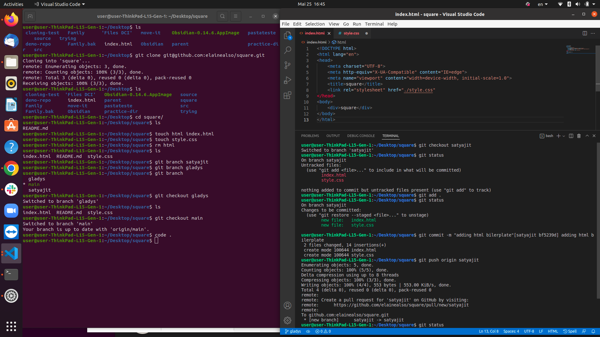

# markdown (Repo title recommended)
# Headline 1
## Headline 2
### Headline 3
#### Headline 4
##### Headline 5
###### Headline 6
####### Headline 7


This is just a normal text (without formatting)


Let's start formatting: **bold** text.

This is *italic*.

This is also _italic_.

This is ~~strike text~~

> This is a quote block

>> This is extra quote block

Formatting differently:

```
This different formatting
```

For terminal: 
```colored```

For JavaScript:
```javascript
console.log("Hello")
```

For Python:
```python
print("Hello")
```

To create links: [this](https://www.google.com/) is a link.

A link in an image: 

Not an online image: 